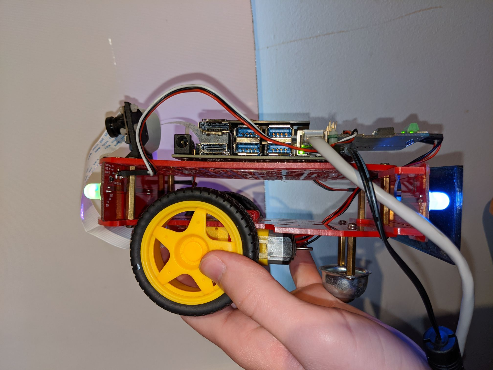

# jetsonbot
Fixing/cleaning/reproducing the Duckieracer PDF - util scripts and stuff

# What dockers to launch

This says the docker compose yamls are https://docs.duckietown.org/daffy/opmanual_duckiebot/out/setup_troubleshooting_docker.html 
basic, health, others, and core. Health doesn't matter here. So we gotta launch the other three.

We can find them here https://github.com/duckietown/duckietown-shell-commands/tree/daffy/init_sd_card/stacks

See the list of dockers in [docker_launcher.py](./docker_launcher.py) (see the end of TODOs for why I used a python
script and not docker compose)

# CUDA inside the docker

So, the jetson nano's docker environment is very weird. For CUDA to work inside the docker, the docker's OS and the JN's
OS must be the same. For example, if the JN has 4.4, the docker also needs 4.4. If the docker has 4.2, CUDA won't work
(or it will work only by itself; for example, pytorch won't work).

I explored [this solution](https://github.com/Technica-Corporation/Tegra-Docker), but it did not work. Again, I could
access basic CUDA features inside the docker, but as soon as I tried linking a library to CUDA, it broke. The library
files that CUDA generates inside the docker are very finicky and very different than a normal CUDA installation.

Instead, what we're "forced" to do, is use the containers that NVIDIA purpose-built for the JN. 

Here is an installation guide on how to use them on amd64: [link](https://github.com/NVIDIA/nvidia-docker/wiki/NVIDIA-Container-Runtime-on-Jetson).
Again, note that the l4t image used in that guide is specific to the JN OS's version at the time of its writing. We have
to make sure that the versioning is correct. We need to use the JP4.4 version of the OS, and the JP4.4 version of the 
images.

Here is the repository that NVIDIA uses to store their images: [link](https://ngc.nvidia.com/catalog/all?orderBy=modifiedDESC&pageNumber=0&query=l4t&quickFilter=&filters=).
For ease of maintenance, I opted for L4T-ML: this image has every "difficult to install" package (except for opencv). 
Normally, our submission templates are either TF or Pytorch-based, and the docker images for those are built differently.
But upon closer inspection, we notice that the only difference between those templates is the framework (TF or torch).
So I opted to cut out any issues, and opt for L4T-ML. This way, there's only one build for any, and since the JN is so
finicky, any debugging only has to be done once. Once our JN integration is more mature, we could instead use L4T-Pytorch
and L4T-TensorFlow instead to better copy the way things are done right now on amd64.

# Things to watch out for

`/var/log/syslog` grew to be VERY large in size over time. Mine was 8GB at some point, and I had trouble prototyping 
dockers because of a lack of space. Now, this might only be because I was prototyping, and shutting down the JN in unsafe
states, and doing other generally "weird dev stuff that the actual JN users won't do" things. 

But still, I think that doing a daily (or on boot) `sudo cat /dev/null > /var/log/syslog`, even though it's normally bad 
practice, might be useful here.

# The current way of building the dockers:

The base closely matches what happens in [aido-protocols](https://github.com/duckietown/aido-protocols/tree/daffy/minimal-nodes-stubs/aido3-base-python3).
But because we're on amd64, we're also building opencv in it: we need to compile it, and it's VERY slow. So instead of 
installing it in the later layers, we're doing it in the base, which hopefully changes elss frequently than the other layers.

Then, we're building the equivalent of the pytorch or TF templates, like [this one](https://github.com/duckietown/challenge-aido_LF-template-pytorch).
So this part is the final image before someone might call `dts submit` or another command that builds a sumbission docker.

A check or argument in the shell will have to be added to build for the JN when we call `dts duckiebot evaluate --native`
to run on a JN. 

I also recommend that using the normal amd64 way of doing things: when a submission is done, we could keep all 
the user's submission files in the workdir, and then when we want to evaluate that same submission on a JN, we could 
just grab the files from inside the docker and build the correct JN docker from them. Because I feel like calculating
the actions directly on the JN would be a great way to evaluate the real feasibility of policies - if they're too slow
to do inference on the JN, they might lose some points, etc.

# TODOs 

Unfortunately, during my last week of internship, I ran in a really, really weird bug. Carmen could get `dts duckiebot keyboard_control`
running just fine on her side, but it seems like my JN's install has something wrong with it. 

I had to choose between reflashing the entire JN and redoing everything, to maybe finish in time for the hand off to you
guys, or to take the time to clean up this repo, add my thoughts, and to document my progress. I feel like the second
option is much more valuable, and so I went with that.

Here's what I would have done, had that bug not stopped me:

+ Run `dts duckiebot keyboard_control` and make sure everything is fine (it should be, if need be ask Carmen)
+ Run `dts duckiebot evaluate` with inference running on the host, as we normally do with the RPIs, as a sanity check
+ Run `dts submit` on a modified Dockerfile that pulls from the dockers built in this repo (also accessible on 
[my dockerhub](https://hub.docker.com/r/velythyl/ml-base))

Now comes the integration part. That would've been a bit hard for me to do, and I feel like it will be better handled by
those who are familiar with the shell, the backend, etc. 

+ Add a JN flashing procedure to the shell. The steps to obtain a working JN are in [init.sh](./init.sh). It should work
out of the box, simply running it as sudo should take care of everything. If it doesn't, ask me or Carmen (she tested it
on her end too)
+ Add something that checks the robot type and recognizes when it's a JN
+ Add the required changes to the way we do `dts submit`, or any other command that builds a submission, to support JNs.
+ Replace the [docker_launcher.py](./docker_launcher.py) file with a docker compose of some sort. It was useful for
prototyping, and because I had to include a `--gpus all` flag, which I had read docker compose didn't support. Another 
reason I didn't use docker compose is that the JN has a custom docker environment that I wasn't sure would play nice with
docker compose.

# Hardware pictures

A note on the camera: it has to be EXACTLY the RPI camera 2. The other camera model we use (I don't know its name, but
the PCB is black) is not compatible with the JN for [some reason](https://forums.developer.nvidia.com/t/raspberry-pi-v2-camera-not-recognized/72844).

We need to use the actual RPI Camera v2 with the green PCB.

Here, there only seems to be two cameras installed. The one mounted to the platform didn't work, and since I didn't really
need to mount the good camera, I didn't lose time with attaching the good camera to the camera mount.

Here's some pictures of most of the angles of the bot:

Note that this bot doesn't have a battery pack. I didn't need it, but it's been tested in [this guide](./Duckieracer_Manual_220120.pdf)
